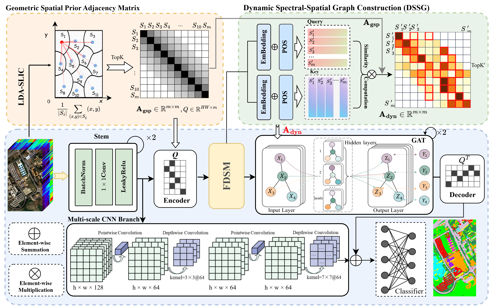

<div align="center">

# GSDG-Net

### Geometric Spatial Prior-Guided Dynamic Graph Learning with Fourier-Modulated Superpixels for Hyperspectral Image Classification

[](https://www.python.org/)
[](https://pytorch.org/)
[](#)
[](#)

Official implementation of **GSDG-Net** for hyperspectral image classification.

**Authors:** Lianlian Zhao, Lina Yang*, Lianhui Liang*, Xinzhang Wu, and Haoyan Yang

<sup>*</sup> Corresponding authors.

</div>

---


## Repository Structure

```text
IEEE_TGRS_GSDG-Net/
|-- Config/
|   `-- config.yaml              # Default experiment configuration
|-- CreateGraph/
|   |-- SLIC.py                  # LDA-SLIC superpixel generation and spatial prior
|   `-- create_graph.py          # Label and mask construction
|-- Model/
|   `-- README.md                # Model release placeholder
|-- assets/
|   `-- Graph2.png               # GSDG-Net architecture overview
|-- HyperLoad.py                 # Dataset loader
|-- Utils.py                     # Metrics, loss, visualization helpers
|-- scheduler.py                 # Optimizer and training schedule
`-- main.py                      # Main training and evaluation entry
```

---

## Architecture Overview

<p align="center">
  
</p>

---

## Installation

```bash
conda create -n gsdg python=3.10 -y
conda activate gsdg

pip install -r requirements.txt
```

If your CUDA/PyTorch environment requires a specific wheel, install PyTorch from the official selector first:

```bash
pip install torch torchvision torchaudio
```

---

## Dataset Access

We provide commonly used hyperspectral image classification datasets through Google Drive:

**Google Drive:** [Hyperspectral datasets](https://drive.google.com/drive/u/1/folders/1fl4Ag3979gGPjJzADrSZ58jR48JzR7CI)

Place the downloaded `.mat` files under:

```text
dataset/
```

Minimal Indian Pines example:

```text
dataset/
|-- indian_pines_corrected.mat
`-- indian_pines_gt.mat
```

---

## Dataset and Hyperparameter Summary

The following table summarizes the datasets included in the public Google Drive collection. A check mark indicates the datasets used in the GSDG-Net paper experiments. Hyperparameters are reported only for the datasets used in the paper.

| Dataset | Used in Paper | Loader Key | Scene Type | Files in Drive | Train Samples | Superpixel Scale `S` | Fusion `lambda` | `d_k` | Top-k | Spatial Prior k |
|---|:---:|---|---|---|---:|---:|---:|---:|---:|---:|
| Indian Pines (IP) | &#10003; | `indian` | Agricultural | `indian_pines_corrected.mat`, `indian_pines_gt.mat` | 10/class | 100 | 0.95 | 16 | 8 | 15 |
| Pavia University (PU) | &#10003; | `paviau` | Urban | `PaviaU.mat`, `PaviaU_gt.mat` | 10/class | 600 | 0.60 | 16 | 8 | 15 |
| Salinas (SA) | &#10003; | `sali` | Agricultural | `Salinas_corrected.mat`, `Salinas_gt.mat` | 10/class | 100 | 0.95 | 16 | 8 | 15 |
| Utopia Planitia (UP) | &#10003; | `UP` | Martian mineral scene | `Utopia.mat`, `Utopia_gt.mat` | 10/class | 800 | 0.60 | 16 | 8 | 15 |
| Botswana |  | `botswana` | Wetland | `Botswana.mat`, `Botswana_gt.mat` | - | - | - | - | - | - |
| Dioni |  | `dioni` | Land cover | `Dioni.mat`, `Dioni_gt.mat`, `Dioni_gt_out68.mat` | - | - | - | - | - | - |
| Fanglu Tea Farm |  | - | Agricultural | `FangluTeaFarm.mat`, `FangluTeaFarm_gt.mat` | - | - | - | - | - | - |
| Holden |  | `HC` | Martian mineral scene | `holden.mat`, `holden_gt.mat` | - | - | - | - | - | - |
| Houston 2013 |  | `houston` | Urban | `Houston13.mat`, `Houston13_gt.mat` | - | - | - | - | - | - |
| Houston 2018 |  | `Houston2018` | Urban | `_houston2018.mat`, `_houston2018_gt.mat` | - | - | - | - | - | - |
| Kennedy Space Center (KSC) |  | `ksc` | Wetland vegetation | `KSC_corrected.mat`, `KSC_gt.mat` | - | - | - | - | - | - |
| LN01 |  | `ln01` | Hyperspectral scene | `LN01_HHSI.mat`, `LN01_GT.mat` | - | - | - | - | - | - |
| Loukia |  | `loukia` | Land cover | `Loukia.mat`, `Loukia_gt.mat` | - | - | - | - | - | - |
| MUUFL Gulfport |  | `muufl` | Urban | `Muufl.mat`, `Muufl_gt.mat` | - | - | - | - | - | - |
| Nili Fossae |  | `NF` | Martian mineral scene | `NiliFossae.mat`, `NiliFossae_gt.mat` | - | - | - | - | - | - |
| Pavia Center |  | `paviac` | Urban | `PaviaC.mat`, `PaviaC_gt.mat` | - | - | - | - | - | - |
| Trento |  | `trento` | Urban/rural | `Trento.mat`, `Trento_gt.mat` | - | - | - | - | - | - |
| WHU-Hi-HanChuan |  | `hanchuan` | Agricultural | `WHU_Hi_HanChuan.mat`, `WHU_Hi_HanChuan_gt.mat` | - | - | - | - | - | - |
| WHU-Hi-HongHu |  | `honghu` | Agricultural | `WHU_Hi_HongHu.mat`, `WHU_Hi_HongHu_gt.mat` | - | - | - | - | - | - |
| WHU-Hi-LongKou |  | `longkou` | Agricultural | `WHU_Hi_LongKou.mat`, `WHU_Hi_LongKou_gt.mat` | - | - | - | - | - | - |
| Xuzhou | &#10003; | `xuzhou` | Peri-urban | `xuzhou.mat`, `xuzhou_gt.mat` | 10/class | 100 | 0.50 | 16 | 8 | 15 |

### Global Training Settings

| Setting | Value |
|---|---:|
| Optimizer | Adam |
| Learning rate | 0.001 |
| Weight decay | 1e-4 |
| Epochs | 400 |
| Repeated runs | 10 |
| Default seeds | `2025, 2026, 2027, 2028, 2029, 2030, 2031, 2032, 2033, 2034` |
| Metrics | OA, AA, Kappa |

---

## Quick Start

This repository is a preliminary public release. The GSDG model implementation and pretrained weights are not included in this version and will be uploaded later.

1. Download the required `.mat` files from the Google Drive link above.
2. Put the files into `dataset/`.
3. Edit `Config/config.yaml` if needed.
4. After the GSDG model implementation is released, run:

```bash
python main.py --path-config Config/config.yaml --iterations 10
```

For a single quick sanity run:

```bash
python main.py --path-config Config/config.yaml --iterations 1
```

---

## Configuration Example

```yaml
model:
  model_name: "GSDG"
  lama: 0.95
  d_k: 16
  topk: 8

data_input:
  dataset_name: "indian"

data_split:
  samples_type: fixed
  train_num: 10
  train_ratio: 0.05
  superpixel_scale: 100

result_output:
  path_weight: ResultsModel/
  path_result: Results/
```

---

## Results Reported in the Paper

| Dataset | OA (%) | AA (%) | Kappa (%) |
|---|---:|---:|---:|
| Indian Pines | 90.10 +/- 2.38 | 93.88 +/- 1.36 | 88.76 +/- 2.68 |
| Pavia University | 95.12 +/- 2.67 | 97.53 +/- 0.84 | 93.66 +/- 3.40 |
| Salinas | 97.91 +/- 0.85 | 98.90 +/- 0.36 | 97.68 +/- 0.95 |
| Utopia Planitia | 91.32 +/- 1.99 | 94.05 +/- 1.97 | 88.09 +/- 2.68 |
| Xuzhou | 95.92 +/- 0.84 | 98.32 +/- 0.54 | 94.87 +/- 1.05 |

---

## Notes

- Large `.mat` datasets are distributed through Google Drive instead of git.
- Result folders and model checkpoints are ignored by default to keep the repository lightweight.
